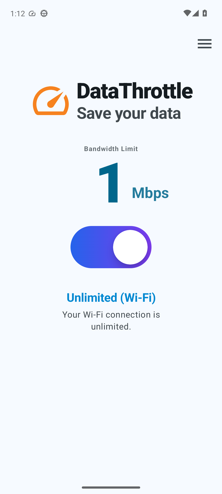
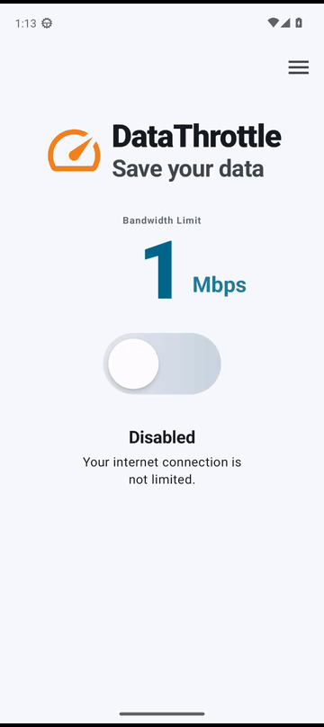
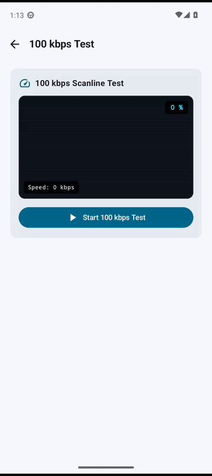

# DataThrottle ⚡

<p align="center">
  
</p>

**モバイルデータの節約と、詳細なモバイル回線帯域制限のための、ルート権限不要（rootless）な軽量Androidユーティリティ。**

<p align="center">
  🌐 <a href="README.md">English</a> • <b>日本語</b> • <a href="README.zh.md">简体中文</a>
</p>

> ⚠️ **注意:** DataThrottleは **ダウンロード（受信）速度のみ** を制限します。アップロード（送信）速度には一切影響しません。

---

## 📌 なぜDataThrottleなのか？

### モバイルデータのジレンマ

現代の4Gおよび5Gネットワークは非常に高速ですが、その快適さにはいくつかの課題があります。

- **過剰なデータ消費** – 動画プラットフォーム（YouTube、TikTok、Instagramリールなど）は、帯域幅が制限されていないとデフォルトで1080pや4Kストリーミングに設定され、数時間で数ギガバイトの月間データ容量を使い果たしてしまいます。
- **厳しい段階制限プランとローミング** – 容量制限のあるプラン、MVNO（格安SIM）、高額な海外ローミングを利用しているユーザーは、突然の通信速度制限や高額な追加料金に直面する可能性があります。
- **OS標準での詳細な制御機能の欠如** – Androidには、ダウンロード速度を制限するための一般ユーザー向けの調整スライダーが用意されていません。

### 既存の解決策が不十分な理由

| 機能・解決策 | Android標準データセーバー | VPN型制限ツール | ルート権限 / `iptables` / `tc` | **DataThrottle** |
| :--- | :---: | :---: | :---: | :---: |
| フォアグラウンドの動画・ストリーミング制限 | ❌ 不可（バックグラウンドのみ） | ⚠️ 可能 | ✅ 可能 | **✅ 可能（正確なMbps制限）** |
| ルート権限不要（rootless） | ✅ 不要 | ✅ 不要 | ❌ 要ルート権限 | **✅ 不要** |
| バッテリーおよびCPUの負荷 | ✅ なし | ⚠️ 高い（ローカルでのパケットループバック） | ✅ なし | **✅ なし（OS標準のカーネルシェイパー）** |
| 他の実際のVPNとの併用 | ✅ 可能 | ❌ 不可（他のVPNをブロック） | ✅ 可能 | **✅ 可能（すべてのVPNと互換あり）** |
| Wi-Fi時の自動パススルー（バイパス） | ❌ 不可 | ⚠️ 手動での切り替えが必要 | ⚠️ 複雑なスクリプトが必要 | **✅ 自動（モバイル回線のみ制限）** |


---

## 📸 デモ動画・画像

| ワンタップ切り替え | 3Dドラムロール帯域選択 | 100 kbps 診断テスト |
| :---: | :---: | :---: |
|  |  |  |
| *ワンタップで即座に速度制限を有効化/無効化* | *スムーズな3Dドラムロール式の速度セレクター* | *リアルタイムのスキャンライン画像読み込みによる検証* |

---

## 🌟 主な機能

- 🎯 **詳細なダウンロード（受信）レート制限** — ダウンロード速度のみを制限し、アップロード速度は制限しません。
  - **0.1–1.0 Mbps** （0.1 Mbps刻み） — 強力なデータ節約や低速ネットワークのシミュレーション向け。
  - **1.5–10.0 Mbps** （0.5 Mbps刻み） — 480p、720p、1080pでのスムーズな動画視聴向け。
  - **11–50 Mbps** （1.0 Mbps刻み） — 高スループットな制限向け。
- 📶 **賢いモバイル回線限定の制限** — 接続状態を常に監視し、モバイルデータ通信時にのみ制限を適用します。Wi-Fi接続時は自動的に無制限（スタンバイ状態）に戻ります。
- 🔋 **VPNによるオーバーヘッドがゼロ** — ローカルVPNループを使用せず、Androidネイティブのトラフィックシェイパー（`Settings.Global.ingress_rate_limit_bytes_per_second`）を利用するため、バッテリーの追加消費やDNSの再ルーティングは発生しません。
- 🛡️ **ルート権限不要（rootless）設計** — デバイス上で完結する **[Shizuku](https://github.com/RikkaApps/Shizuku/)** 、またはPCからの標準的なADBコマンドを使用して、初回のみ権限を付与します。
- 🎛️ **クイック設定タイル** — 通知シェードから直接制限のオン/オフを切り替えられます。
- 🧪 **100 kbpsのビルトイン診断テスト** — 段階的に読み込まれるスキャンライン画像のダウンロードにより、速度制限が正しく機能しているかを検証し、測定された実際のビットレートを表示します。
- 🎨 **モダンなMaterial 3 UI** — Jetpack Composeで構築されており、スムーズな3Dスクロールピッカー、ダーク/ライトテーマ、日本語・英語・中国語へのローカライズに対応しています。
- 🧹 **安全なリセットとクリーンなアンインストール** — アプリを削除する前に、すべてのAndroidシステムネットワーク設定を元の状態に復元するリセット機能を備えています。

---

## 🚀 はじめに ＆ 権限のセットアップ

Androidはシステムレベルの速度制限設定を保護しているため、DataThrottleを初めて起動する際に **3つの権限** を付与する必要があります。

| 番号 | 目的 | 権限 |
| :---: | :--- | :--- |
| 1 | 帯域制御 | `WRITE_SECURE_SETTINGS` |
| 2 | ステータス通知 | `POST_NOTIFICATIONS` (Android 13以上) |
| 3 | バックグラウンド実行 | `REQUEST_IGNORE_BATTERY_OPTIMIZATIONS` |

### ステップ 1: 帯域制御の権限付与 (`WRITE_SECURE_SETTINGS`)

**方法A — Shizuku（推奨、PC不要）**
1. **[Shizuku](https://github.com/RikkaApps/Shizuku/releases)** （GitHubから入手可能）をインストールして起動します。
2. スマートフォンの「ワイヤレスデバッグ」を使用してShizukuを開始します。
3. **DataThrottle** を開き、セットアップ画面で **「ワンタップで権限を付与」** （Grant with One Tap）をタップします。

**方法B — PCからのADBコマンド（開発者向け）**
1. デバイスで「開発者向けオプション」と「USBデバッグ」を有効にします。
2. USBケーブルまたはワイヤレスADBを使用して、デバイスをPCに接続します。
3. 以下のコマンドを実行します：
   ```bash
   adb shell pm grant com.datathrottle android.permission.WRITE_SECURE_SETTINGS
   ```
4. DataThrottleで **「権限の確認」** （Check Permission）をタップして確認します。

### ステップ 2: 通知の有効化 ＆ バッテリー最適化の除外

- **ステータス通知** — 「通知を許可」をタップして、リアルタイムのステータス表示を有効にし、フォアグラウンドサービスの安定動作を維持します。
- **バックグラウンド実行** — 「最適化から除外」をタップして、画面消灯時にOEMのバッテリー管理機能によってサービスが終了されないようにします。

---

## 📖 使い方

1. **速度の選択** — 3Dドラムロールピッカーをスクロールして、制限したい帯域幅（例: `1.0 Mbps`）を選択します。
2. **サービスをオンにする** — トグルスイッチを **ON** にします。
3. **自動動作について**
   - モバイル回線接続時：選択した上限にダウンロード速度が制限されます。
   - Wi-Fi接続時：サービスは **スタンバイ（無制限）** 状態になります。
4. **クイック設定** — クイック設定パネルにDataThrottleのタイルを追加することで、いつでもワンタップで切り替えが可能です。

---

## 🧪 診断テストによる速度の検証

速度制限が正しく動作しているか確認するには：
1. アプリ内の **「設定」（右上アイコン）** から **「100 kbpsテスト」** を開きます。
2.  **「100 kbpsテストを開始」** をタップします。
3. アプリが一時的に厳密な 100 kbps の制限を適用し、診断用画像を1行ずつダウンロードします。これにより、実際のスループットが設定通りに制限されているかを確認できます。

---

## 🧹 安全なリセットとクリーンなアンインストール

DataThrottleをアンインストールする前に、Androidのネットワーク設定をデフォルトに戻しておくことを推奨します：
1. DataThrottle内の **「設定」（右上アイコン）** を開きます。
2. **「リセットしてアンインストールの準備をする」** （Reset & Prepare for Uninstall）をタップします。
3. 確認ダイアログを承認します。これにより、`ingress_rate_limit_bytes_per_second` が `-1`（無制限）に戻り、サービスの構成がクリアされます。

---

## 🛠️ テクニカル・ディープダイブ：仕組みについて

### なぜカーネルレベルのトラフィックシェーピングなのか？

多くのサードパーティ製帯域管理アプリは、ローカルに `VpnService` トンネルを作成して動作します。このアプローチは特別な権限を必要としない一方で、以下のような課題があります。
- すべてのパケットがユーザー空間を経由するため、CPUのオーバーヘッドとバッテリー消費が顕著になります。
- 実際のVPN（社内VPN、WireGuard、Tailscale、AdGuardなど）と競合し、同時利用ができません。
- 遅延やパケットロスの原因となることがあります。

一方、DataThrottleはAndroidのシステムネットワーク制限機能に直接書き込みを行います：

```kotlin
Settings.Global.putLong(
    contentResolver,
    "ingress_rate_limit_bytes_per_second",
    bytesPerSecond
)
```

- **カーネルによる直接制限** — 受信（ダウンロード）トラフィックを制御する、Linuxカーネルの `tc`（traffic control）/ eBPF の **ingress** サブシステムによって直接処理されます。送信（アップロード）トラフィックは一切変更されません。
- **遅延とバッテリーへの影響がゼロ** — ユーザー空間でのパケット介入がないため、カーネル内でパケットが処理され、遅延や追加のバッテリー消費が発生しません。
- **接続状態の変化に対する動的検知** — フォアグラウンドサービスが `ConnectivityManager.NetworkCallback` を介して常にネットワーク状態の変化を監視し、モバイル回線を利用しているときのみ制限を適用します。

---

## 💻 ソースコードからのビルド

### 前提条件

- Android Studio Hedgehog (2023.1.1) 以降
- JDK 17以上
- Android SDK 34 (Android 14)

### クローンとビルド

```bash
# リポジトリをクローン
git clone https://github.com/zaochuan5854/DataThrottle.git
cd DataThrottle

# デバッグ用APKのビルド
./gradlew assembleDebug

# ユニットテストおよびインストルメンテーションテストの実行
./gradlew test
```
